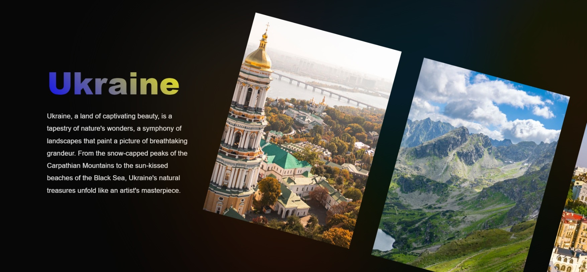

# ScrollArt

ScrollArt is a visually stunning website featuring a gallery with captivating effects and animations. The project incorporates a parallax effect for scrolling through images, providing a dynamic and engaging user experience. Additionally, clicking on images triggers an animated opening and closing effect, enhancing the interactive nature of the gallery.

## Features

1. **Parallax Scrolling Gallery**: The gallery utilizes a parallax effect, creating a visually appealing transition as users scroll through images.

2. **Interactive Image Animation**: Clicking on images triggers an animated opening and closing effect, adding a layer of interactivity to the gallery.

3. **Animated Background**: The background smoothly shimmers with colors extracted from the images, creating a seamless and aesthetically pleasing visual experience.

4. **Text and Title Animation**: The title and text of the composition feature animations for hiding and appearance, enhancing the overall presentation.

5. **Text Gradient with CSS**: A text gradient, achieved using CSS, adds a stylish and modern touch to the text elements in the composition.

## Dependencies

The following libraries are used in this project:

- [Swiper](https://swiperjs.com/): A modern touch slider with hardware-accelerated transitions and amazing native behavior.

## Preview

